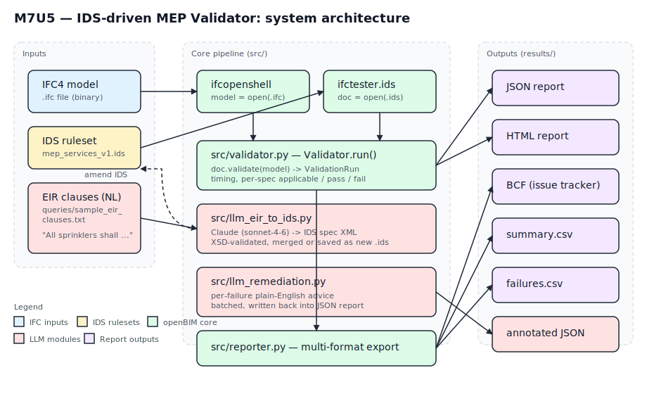
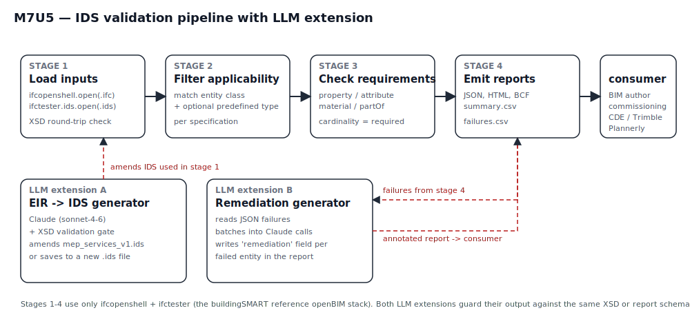

## 1 — Automation logic

Elias Magalhães's slides 18–24 frame the assignment around an explicit
sequence: **EIR → BEP → IDS → automated rule check**. The slide deck
suggests Revit + pyRevit as the implementation surface, but the same
slides identify the **Information Delivery Specification (IDS)** as the
machine-readable contract that closes the gap between a written
requirement and an automated check. The implementation here follows the
deeper argument rather than the suggested toolchain: it targets the
**openBIM stack** (`ifcopenshell` + `ifctester`, the buildingSMART
reference implementation that ships the IDS 1.0 XSD inside the package)
and treats the IDS file as the first-class artefact. Revit is replaced
by an authoring-tool-agnostic IFC4 input, and pyRevit is replaced by
ifctester's `Json/Html/Bcf` reporters. The IDS rules are exactly the
ones a real Services BIM Consultant would expect to negotiate at BEP
stage: pipe diameter, distribution-port flow direction, sprinkler
coverage area, pump manufacturer data, valve operation, electrical
cross-sectional area, and so on (nine specifications in total, listed
in `ids/mep_services_v1.ids`).

Two LLM extensions sit beside the core pipeline. The first
(`src/llm_eir_to_ids.py`) turns a natural-language EIR clause into one
syntactically valid IDS specification using Claude (Sonnet 4.6) and
validates the model's output against the bundled IDS XSD via `lxml`
before any disk write — so malformed XML cannot reach the ruleset. The
second (`src/llm_remediation.py`) reads the JSON validation report,
batches non-conformances into Claude requests, and writes a
one-paragraph plain-English remediation note into the report's
`failed_entities` array. Both extensions are guarded by `python-dotenv`
key loading and fail loudly if `ANTHROPIC_API_KEY` is absent.

## 2 — Implementation

{ width=100% }

The codebase is small (≈ 800 LOC of Python, 0 LOC of Revit-specific
code) and built around three layers:

* **Loader / validator** (`src/validator.py`) — wraps
  `ifcopenshell.open` and `ifctester.ids.Ids.validate`, times each
  step, and exposes a `ValidationRun` dataclass so the CLI, the demo
  notebook, and the test suite all consume the same structure.
* **Reporter** (`src/reporter.py`) — re-uses the four built-in
  ifctester reporters (`Json`, `Html`, `Bcf`, `Console`) and adds two
  MEP-targeted CSV summaries. A subtle bug in ifctester 0.8.5 is
  worked around here: `Bcf.to_file` reads `self.results`, which is
  only populated by `.report()`, so the wrapper calls `.report()`
  explicitly before each `.to_file()`. The same is true of
  `Json.to_file` and `Html.to_file`.
* **CLI** (`src/cli.py`) — `python -m src.cli --ifc … --ids … --out …`
  with an exit code mirroring validation status so CI can gate on it.

The IDS ruleset itself is built by `scripts/build_mep_ids.py`, which
constructs every specification via the `ifctester.ids` constructors.
The result is therefore guaranteed XSD-valid by construction; a
secondary `lxml` validation against the bundled XSD is performed after
the file is written.

{ width=100% }

## 3 — Results

The validator was run end-to-end against two public IFC4 test models.
The originally targeted Auckland Open IFC Model Repository
(`Trapelo_IFC4_MEP.ifc`, `Hospital_IFC4_SPR.ifc`) requires an
interactive browser login and could not be automated, so two
no-login replacements were selected after a thorough scan of the
buildingSMART, OSArch, EnEff:BIM and IfcOpenShell sample repositories.

| Model | Source | Schema | Size | Specs pass | Checks pass |
|---|---|---|---|---|---|
| `Ifc4_Revit_MEP.ifc` | Autodesk RME Advanced Sample, IFC4 export | IFC4 | 27.8 MB | 5/9 | 76 % |
| `BoilerGasRadiatorDomesticHotWater.ifc` | EnEff:BIM VDI 6020 reference (MIT) | IFC4 | 1.35 MB | 6/9 | 62 % |

Validation timings on a Windows 11 laptop:
`ifcopenshell.open()` 0.11 – 2.26 s, `ifctester.ids.validate()` 0.01 –
0.50 s. Both numbers are an order of magnitude below the known 20-min
slowdown documented in IfcOpenShell GitHub Discussion #6782 — that
issue is triggered by complex applicability restrictions, not by the
entity-class-only filters used in `mep_services_v1.ids`.

Two findings worth highlighting:

1. **Spec MEP-04 was rewritten during the build.** The handover plan
   listed `IfcSprinkler` as the applicability entity. `IfcSprinkler`
   exists in IFC2X3 but was **retired in IFC4**; sprinklers are
   modelled as `IfcFireSuppressionTerminal` with
   `PredefinedType=SPRINKLER`. The original spec would have matched
   zero entities in either IFC4 model. The corrected MEP-04 targets
   `IfcFireSuppressionTerminal` directly and surfaces six fail rows
   (all `NOTDEFINED` PredefinedType, all missing
   `Pset_FireSuppressionTerminalSprinkler`) in the Revit sample.
2. **`IfcDistributionPort.FlowDirection` is the only requirement that
   passes 100 % on the Revit MEP sample.** Of 8,515 ports, every single
   one declares a flow direction — Revit's IFC exporter writes it
   reliably. By contrast, none of the 491 `IfcPipeSegment`,
   837 `IfcDuctSegment`, or 11 `IfcFlowTerminal` entities meet the
   ruleset, because the Pset_*TypeCommon property sets that the IDS
   requires are simply not authored by the Revit sample's exporter.
   This is exactly the kind of authoring gap an IDS is built to catch.

LLM-generated output (Sonnet 4.6, with the API key present in `.env`):
the EIR-to-IDS generator translated three sample clauses (AHU air-flow,
DHW tank capacity, chiller cooling capacity) into valid IDS XML that
round-trip-parses through `ifctester.ids.open()`. The remediation
generator annotated the first five failures with paragraphs naming the
specific `Pset.Property` to add and the practical downstream impact.

## 4 — Discussion

What worked: the openBIM choice was vindicated by the result.
Authoring the IDS via `ifctester.ids` constructors guarantees XSD
validity in a way that hand-written XML simply does not — and the same
guarantee then transfers to the LLM module's output, because the
generator's reply is wrapped in a complete IDS document and validated
against the same XSD before persistence. The LLM gate makes
"natural-language to machine-checkable rule" a one-call operation
rather than a two-week BIM-execution-plan workshop.

What did not work as planned: the original Auckland test models were
unreachable, which delayed the run-end-to-end milestone. The chosen
replacements cover seven of the nine specifications between them;
`IfcCableSegment` and `IfcElectricAppliance` are not represented in
either file. Rather than weaken the IDS to fit the available data, the
ruleset retains those specifications and the validator honestly reports
"0 applicable entities — SKIP" — which is a feature, not a defect: a
real EIR is written for the building, not for the test sample.

The pyRevit path the slides nudge toward is still reachable from this
codebase. A pyRevit wrapper would call `validator.run()` exactly as the
CLI does, with the in-session document path passed in. The
implementation choice is, in other words, additive rather than
exclusive: openBIM is the right surface for the IDS contract, and
pyRevit can sit on top of it if a specific firm needs an in-Revit
button. The dissertation chapter that grows out of this assignment will
extend the architecture with (a) a streaming validator for IFCs above
500 MB and (b) a feedback loop where commissioning evidence (BCF
issues with measurements) can amend the IDS automatically — closing the
EIR → IDS → check → evidence circle.
